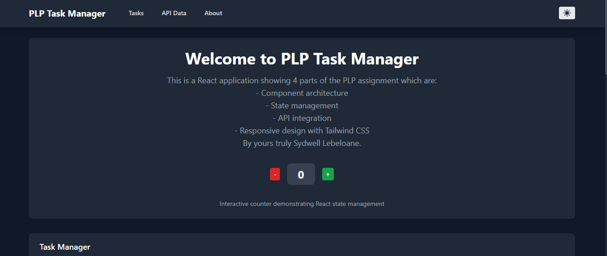

# PLP Task Manager - Week 3 React.js Assignment

A modern, responsive task management application built with React.js, JSX, and Tailwind CSS, demonstrating component architecture, state management, hooks usage, and API integration.

## 📖 Project Overview

This project is the Week 3 assignment, Created by implementing:

- **Component Architecture**: Reusable UI components with proper props and validation
- **State Management**: React hooks including useState, useEffect, and useContext
- **API Integration**: Fetch data from JSONPlaceholder with loading states and pagination
- **Responsive Design**: Mobile-first design using Tailwind CSS
- **Theme Management**: Dark/light mode toggle functionality

## 📸 Application Screenshot



*The application features a dark theme with a clean, modern interface showing the welcome section, interactive counter, and task management functionality.*

## Features

### Core Functionality
-  **Task Management**: Add, complete, delete, and filter tasks
- **Data Persistence**: Tasks saved to localStorage
- **API Integration**: Fetch and display posts from JSONPlaceholder
- **Search & Pagination**: Filter API results with pagination
- **Theme Toggle**: Dark/light mode switching
- **Responsive Design**: Works on mobile, tablet, and desktop

## Tech Stack

- **React 18.2.0** - UI library
- **Vite** - Build tool and dev server
- **Tailwind CSS 3.2.7** - Utility-first CSS framework
- **React Router 6.8.1** - Client-side routing
- **Axios 1.3.4** - HTTP client for API calls
- **PropTypes** - Runtime type checking

## Assignment Requirements Fulfilled

### Task 1: Project Setup
- [x] React application created with Vite
- [x] Tailwind CSS installed and configured
- [x] Proper project structure with components, contexts, hooks

### Task 2: Component Architecture
- [x] Button component with variants (primary, secondary, danger, success, warning)
- [x] Card component for boxed content layout
- [x] Navbar component with navigation and theme toggle
- [x] Footer component with links and copyright
- [x] Layout component including Navbar and Footer

### Task 3: State Management and Hooks
- [x] TaskManager with CRUD operations
- [x] useState for component state management
- [x] useEffect for side effects and data loading
- [x] useContext for theme management (light/dark mode)
- [x] Custom useLocalStorage hook for task persistence

### Task 4: API Integration
- [x] Fetch data from JSONPlaceholder API
- [x] Display data in responsive grid layout
- [x] Loading and error state implementation
- [x] Pagination (6 posts per page)
- [x] Search feature to filter results

### Task 5: Styling with Tailwind CSS
- [x] Responsive design (mobile, tablet, desktop)
- [x] Dark/light mode theme switcher
- [x] Tailwind utility classes for layout and styling
- [x] Custom animations and transitions

## Getting Started

### Prerequisites
- Node.js (v18 or higher)
- npm or yarn package manager

### Installation

1. **Clone the repository**

2. **Install dependencies**
   ```bash
   npm install
   ```

3. **Start development server**
   ```bash
   npm run dev
   ```

### Available Scripts

```bash
npm run dev      # Start development server
npm run build    # Build for production
npm run preview  # Preview production build
npm run lint     # Run ESLint
```

### Testing Results
-  Task Manager: Add, complete, delete, filter tasks
-  Data Persistence: LocalStorage working correctly
-  API Integration: JSONPlaceholder fetch with pagination
-  Theme Toggle: Dark/light mode switching
-  Responsive Design: Mobile-first layout
-  Search Functionality: Real-time filtering
-  Error Handling: Loading states and error boundaries

### Build Information
```bash
Build Output:
✓ 51 modules transformed
dist/index.html                   0.47 kB │ gzip:  0.30 kB
dist/assets/index-0f3caa70.css   19.58 kB │ gzip:  4.07 kB  
dist/assets/index-c7abf926.js   170.89 kB │ gzip: 54.49 kB
✓ built in 31.02s
```